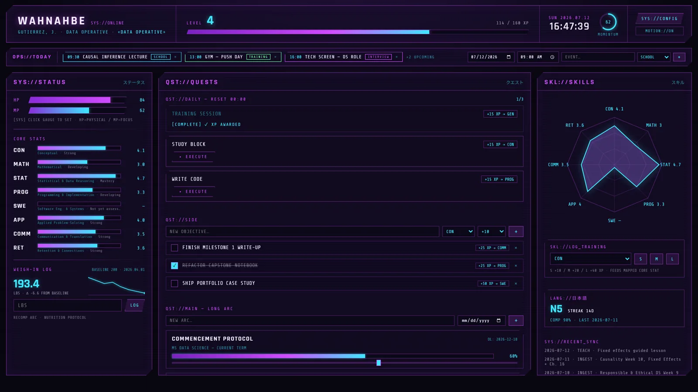
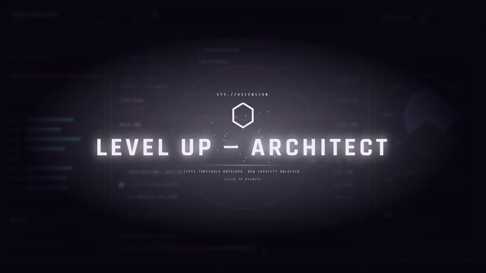

# WAHNAHBE SYSTEM

A Solo Leveling-style life-RPG dashboard that runs permanently on my machine and holds my whole life: learning progress, quests, health, agenda, and Japanese study — fed live by my second-brain Obsidian vault.



## The idea: files are the API

There is no database, no cloud, no auth. The dashboard is a local Express server + React SPA whose entire state is **plain files**:

- **Read-only vault sources** — my learning report card, tutoring gradebook, concept-mastery tracker, wiki activity log, and Japanese `progress.md` are markdown files maintained by Claude tutoring sessions. The server parses them live into an 8-stat mastery octagon, cumulative XP + level, and activity feeds.
- **Dashboard-owned state** — quests, health, agenda, XP ledger, and settings live as schema-validated JSON inside the vault. Any Claude Code session (or any editor) can update the dashboard just by editing a file.

A chokidar watcher pushes every file change to the browser over SSE, so the dashboard reflects a finished tutoring session — or a hand-edited JSON file — within about a second.

## What it does

| | |
|---|---|
| **XP & levels** | One unified pool: report-card XP (parsed from the vault) + an append-only XP ledger. Crossing a threshold fires a full-screen LEVEL UP overlay, exactly once per crossing. |
| **8-stat octagon** | The radar plots real mastery scores (1–5) from graded tutoring sessions — not self-reported numbers. |
| **Quests** | Dailies (midnight reset), one-off side quests (+10/25/50 XP), and long-arc main quests with progress sliders. |
| **Health** | Click-to-set HP/MP gauges and a weigh-in log with sparkline + delta from baseline. |
| **Agenda** | Quick-add events plus Google Calendar sync (via a Claude skill that merges by `gcalId`, never touching manual entries). |
| **Japanese** | Level, streak, and rolling comprehension parsed from the tutoring vault's frontmatter, with a staleness nudge after 14 idle days. |



## Architecture

```
second-brain vault (markdown + JSON)          THESYSTEM
┌─────────────────────────────────┐   ┌─────────────────────────────┐
│ report card / gradebook / logs  │──▶│ parsers (read-only)         │
│ jp progress.md                  │   │                             │
│                                 │   │ Express API  ──▶  React SPA │
│ system/*.json (dashboard state) │◀─▶│ zod + atomic writes         │
└─────────────────────────────────┘   │ chokidar ──▶ SSE live push  │
                                      └─────────────────────────────┘
```

- **Server** (`server/`) — Express 4, the only component that touches disk. Vault sources degrade per-source (`[SYS] DATA LINK LOST`) instead of crashing the endpoint; state writes are zod-validated then written atomically (temp + rename). The XP ledger is append-only and `awardXp` is its sole writer — completions award XP *before* persisting quest state, so a failed write can never strand a completed quest with no XP.
- **Web** (`web/`) — React 18 + Vite. The design is a faithful port of a Claude Design HUD mock: clip-path panels, scanlines, boot sequence, Rajdhani/Share Tech Mono type. Reduced-motion mode kills all animation.
- **Deployment** (`scripts/`) — a Windows Task Scheduler task launches the production server hidden at logon. The launcher is synchronous, so the task instance lives and dies with the node process, and a 5-minute watchdog trigger (with `IgnoreNew`) restarts it unattended after a crash — measured recovery: 53 seconds. Binds `127.0.0.1` only.
- **Claude integration** (`.claude/skills/`) — skills for calendar sync, banking XP from any conversation, and rebuild-and-restart. `CLAUDE.md` documents the file contracts so any session can edit state safely.

## Testing

75 tests: parser units against real-format fixtures (including malformed variants), XP-engine boundary math, supertest API integration on a fixture vault, and a Playwright E2E that boots a sandboxed production server, completes a quest, and proves the SSE live-update loop by editing a vault file on disk mid-test.

```bash
npm test      # server + web suites
npm run e2e   # playwright smoke on an isolated fixture vault
```

## Running it

Built for my machine, but the paths are env-driven:

```bash
npm install
npm run build
WAHNAHBE_VAULT=/path/to/vault WAHNAHBE_JP_VAULT=/path/to/jp npm start   # http://localhost:4777
```

Dev mode: `npm run dev` (server) + `npm run dev --workspace=web` (Vite on :5173, proxied).

## Provenance

Spec-first build: [design spec](docs/superpowers/specs/2026-07-11-wahnahbe-dashboard-design.md) → [20-task TDD implementation plan](docs/superpowers/plans/2026-07-11-wahnahbe-dashboard.md) → subagent-per-task execution with independent spec + quality review gates on every task, then a whole-branch final review. The visual source of truth is [the original design mock](docs/design/wahnahbe-v2.dc.html).

*Screenshots show staged demo data.*
